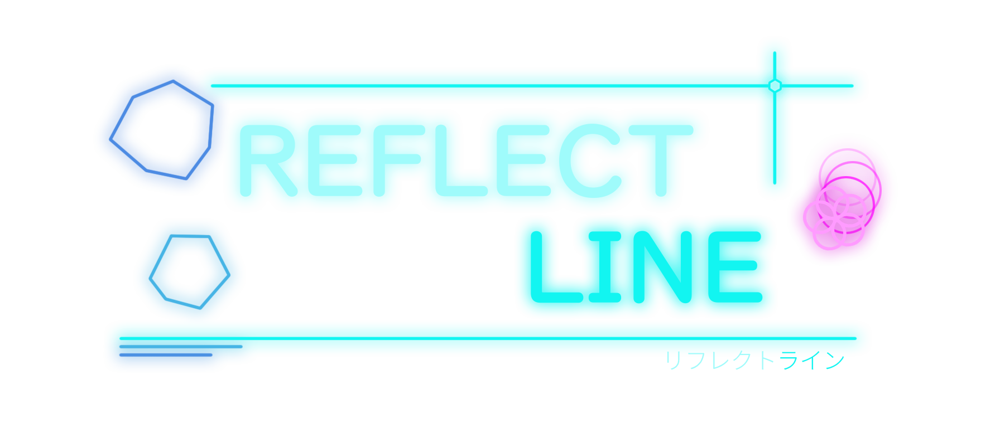

   

---
> ### 操作説明
**キーボード**

**Xboxコントローラ**

 

> ### ゲーム概要
<table>
    <tr>
        <th>ジャンル</th>
        <td>反撃型回避アクション</td>
    </tr>
    <tr>
        <th>操作端末</th>
        <td>キーボード / コントローラ</td>
    </tr>
    <tr>
        <th>プレイ人数</th>
        <td>1人</td>
    </tr>
    <tr>
        <th>開発期間</th>
        <td>2025年4月 ～ 現在</td>
    </tr>
    <tr>
        <th>開発人数</th>
        <td>2人</td>
    </tr>
    <tr>
        <th>使用技術</th>
        <td>C++ / DxLib</td>
    </tr>
</table>
 

> ### ルール
以下のサイクルを繰り返しながら、ハイスコアを目指します。

**避ける → 取る → 反射 → 壊す**

* 障害物（レーザー・隕石など）に1回でも当たるとゲームオーバー
* アイテムを取ると「反射モード」になり、レーザーを反射可能
* 反射したレーザーは隕石に自動追尾し、破壊するとスコア獲得

操作は移動とダッシュのみ。
シンプルながら、状況判断とリスク管理が問われる設計になっています。

---

## こだわりポイント

### 視認性と演出を両立したビジュアル

「きれい × かっこいい」をテーマに、線や図形を主体とした目を惹くデザインにしました。

アニメーションやサウンドにもこだわり、見ていて飽きない**動き**のあるゲームデザインを目指しました。

↓ 背景アニメーション

↓ Levelアニメーション

## 隕石
形と線の数は独自のアルゴリズムでランダム生成しています。
また、壊した時の演出にこだわり、壊した時の気持ち良さを感じるよう工夫しました。

### プログラム設計への工夫

* 管理クラスを中心としたシングルトン設計
* エフェクト専用の EffectManager による演出管理
* 隕石形状をランダム生成するアルゴリズム
* DxLib向け自作ライブラリ **KR_Lib** による開発効率化
